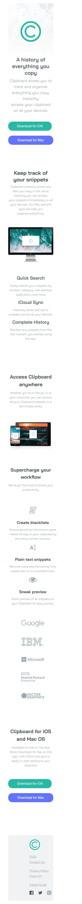

# Frontend Mentor - Clipboard landing page solution

This is a solution to the [Clipboard landing page challenge on Frontend Mentor](https://www.frontendmentor.io/challenges/clipboard-landing-page-5cc9bccd6c4c91111378ecb9). Frontend Mentor challenges help you improve your coding skills by building realistic projects. 

## Table of contents

- [Overview](#overview)
  - [The challenge](#the-challenge)
  - [Screenshot](#screenshot)
- [My process](#my-process)
  - [Built with](#built-with)
  - [What I learned](#what-i-learned)
  - [Continued development](#continued-development)


## Overview

### The challenge

Users should be able to:

- View the optimal layout for the site depending on their device's screen size
- See hover states for all interactive elements on the page

### Screenshot





### Links

- Solution URL: [Add solution URL here](https://your-solution-url.com)
- Live Site URL: [Add live site URL here](https://your-live-site-url.com)

## My process

### Built with

- Semantic HTML5 markup
- CSS custom properties
- Flexbox
- CSS Grid


### What I learned

I learnt how to make use of flexbox and css grid and i must say it was challenging, i got to use media query for the first time and i will tell you it was quite hectic.

```html
<h1>Some HTML code I'm proud of</h1>
```
```css
.proud-of-this-css {
  !important; To overwrite inline css
}
```
@media ( {
  body {

  }
})
```

### Continued development

The overall layout of a website
flexbox and grid
media query


## Author

- Website - [Sadeeq-dev](https://www.your-site.com)
- Frontend Mentor - [@Sadeeq-dev](https://www.frontendmentor.io/profile/Sadeeq-dev)
- Twitter - [@yahayasadiq14](https://www.twitter.com/yahayasadiq14)


## Acknowledgments

I acknowledge myself for achieving this feat as a beginner.
